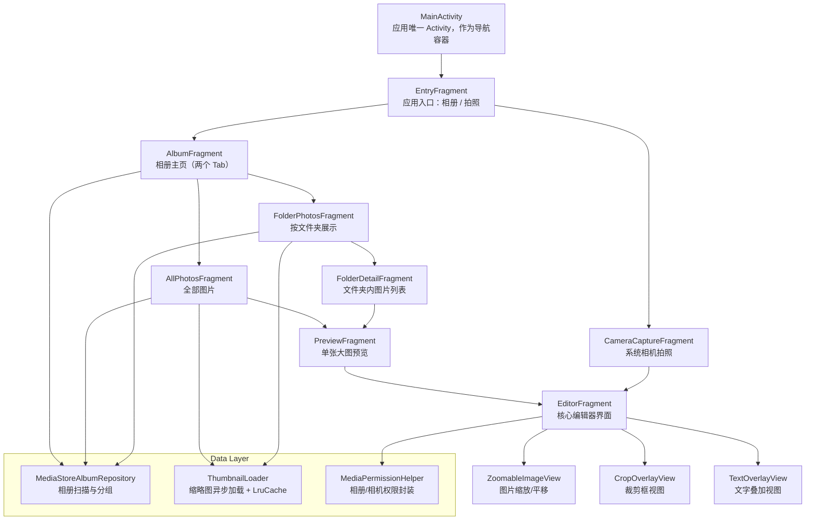

# LightEdit – Android 图片编辑应用（TT-IC-Camera 客户端工程训练营）

本项目是 **「客户端工程训练营（TT-IC-Camera）」** 的 Android 端实现，目标是开发一款基于 Kotlin 的轻量级图片编辑 App，覆盖从 **相册选图 / 相机拍照 → 图像编辑 → 保存到相册（带水印）** 的完整链路。

项目除了实现要求中的所有核心功能外，还重点体现：

- 工程化流程：Git 工作流、规范化分支
- 模块化架构：UI / Data / Editor / Core 分层  

> 截止时间：**2024-12-04**（在此之前完成全部功能、测试与集成，并提交 GitHub 仓库 + 文档 + 视频）

---

## 1. 项目背景与目标

### 1.1 项目背景

在移动互联网时代，图片编辑工具广泛应用于社交分享、工作汇报和创意设计等场景。本作业以 **“轻量高效、功能实用、体验流畅”** 为核心定位，要求完成一个面向大众用户的图片编辑 App。

### 1.2 项目目标

- **技术目标**
  - 熟练使用 **Kotlin + Android** 完成客户端开发；
  - 实现图像的加载、处理、保存等核心能力；
  - 掌握性能优化（相册流畅度、编辑响应速度、内存控制等）；
  - 正确处理权限、存储失败、无相机等异常场景。

- **产品目标**
  - 实现一款功能完整、操作简洁、运行稳定的图片编辑工具；
  - 满足用户基础编辑需求（裁剪、旋转、文字、调节等）；
  - 拥有良好的易用性与一定的扩展性（支持加分功能扩展）。

---

## 2. 技术栈与架构

- 开发语言：Kotlin
- 开发工具：Android Studio
- 最低系统版本：Android 10（API 29）
- 架构模式：单 Activity + 多 Fragment
- UI 技术：原生 View、ViewBinding、RecyclerView、自定义 View
- 系统能力：
  - MediaStore 相册查询与图片保存
  - 系统相机拍照（Activity Result API）
  - 运行时权限（相册 / 相机 / 存储）

说明：项目中未使用第三方图像处理库，裁剪、缩放、旋转、亮度/对比度、文字叠加、合成保存均为手动实现。仅使用 AndroidX、Material 等官方支持库。

> 关于 iOS 端：作业要求中包含 iOS 兼容性，但本仓库专注 **Android 客户端实现**。iOS 相关内容将只在技术文档中进行架构和跨平台设计层面的简要讨论，不做实际实现。

---

## 3. 项目结构概览

本项目采用「单 Activity + 多 Fragment」架构，结合多个自定义 View、相册数据层、权限与图像加载工具，形成清晰的模块划分。  
整体结构如下图所示：

### 1. MainActivity 模块
- MainActivity  
  单 Activity 容器，负责承载所有 Fragment，并协调导航。

### 2. Entry（入口）模块
- EntryFragment  
  应用主入口界面，包含两个按钮：进入相册 和 拍照编辑。

### 3. 相册 Album 模块
- AlbumFragment  
  相册主界面，包含两个 Tab：全部图片、按文件夹显示。

- AllPhotosFragment  
  加载并展示系统中所有图片。

- AllPhotosAdapter  
  RecyclerView 适配器，用于显示全部图片的缩略图。

- FolderPhotosFragment  
  加载系统相册并按文件夹分组展示。

- FolderPhotosAdapter  
  展示相册文件夹封面和数量的适配器。

- FolderDetailFragment  
  显示某一文件夹下所有照片的页面。

- PreviewFragment  
  图片预览界面，支持查看大图并进入编辑器。

- MediaStoreAlbumRepository  
  基于 MediaStore 查询手机图片、分组、加载元数据的核心数据层类。

- PhotoItem  
  单张照片的数据结构，包含 uri、路径、时间等信息。

- AlbumFolder  
  相册文件夹的数据结构，包含封面图、文件夹名、数量等信息。

### 4. 相机 Camera 模块
- CameraCaptureFragment  
  调用系统相机进行拍照，将结果 uri 返回给编辑器。

### 5. 编辑 Editor 模块
- EditorFragment  
  图片编辑核心界面，管理缩放、裁剪、旋转、亮度、对比度、文字、保存等全部编辑功能。

### 6. 编辑视图 View 模块
- ZoomableImageView  
  自定义图片缩放控件，实现双指缩放与拖动平移。

### 7. 裁剪 Crop 模块
- CropOverlayView  
  裁剪遮罩视图，绘制裁剪框、控制点、半透明区域，并支持拖动与调整大小。

### 8. 文字 Text 模块
- TextElement  
  文本元素的数据结构，包含内容、位置、字体、字号、颜色、透明度、缩放、旋转等属性。

- TextOverlayView  
  文本叠加视图，负责绘制文字、处理点击命中、拖动、缩放、旋转等手势。

### 9. 工具类与辅助模块
- ThumbnailLoader  
  后台线程池 + LruCache 的缩略图加载器，高性能加载相册缩略图。

- MediaPermissionHelper  
  封装相册、相机、存储权限申请与 Android 10+ / 13+ 的适配。

## 4. 核心功能说明

### 4.1 相册选图

- 通过 MediaStore 加载本地图片。  
- 提供两个 Tab：  
  1. 全部图片（AllPhotosFragment）  
  2. 按文件夹分组（FolderPhotosFragment）  
- 在无权限、相册为空时提供提示。  
- 使用 ThumbnailLoader 异步加载正方形缩略图，并提供缓存避免卡顿和内存浪费。  
- 支持点击缩略图进入 PreviewFragment，并可一键进入编辑界面 EditorFragment。

---

### 4.2 相机拍照

- 使用 Activity Result API 调用系统相机拍摄照片。  
- 成功拍摄后自动跳转到编辑界面。  
- 处理无相机、权限被拒绝、用户取消等异常情况。  

---

### 4.3 图片缩放与平移

- 自定义 ZoomableImageView 组件实现图片可缩放与平移。  
- 初次加载自动进行 FitCenter 适配。  
- 双指缩放范围为 0.5x – 2x。  
- 单指拖动图片浏览细节。  
- 边界限制逻辑保证图片不会被拖出可视区域。  

---

### 4.4 图片裁剪

- 使用 CropOverlayView 绘制裁剪框与遮罩。  
- 支持裁剪比例：自由裁剪、1:1、4:3、16:9、3:4、9:16。  
- 支持拖动裁剪框位置、拖动四角进行缩放。  
- 在 EditorFragment 中根据裁剪框计算并生成最终裁剪后的 Bitmap。  

---

### 4.5 旋转与翻转功能

- 支持以下操作：  
  - 顺时针旋转 90°  
  - 逆时针旋转 90°  
  - 180° 旋转  
  - 水平翻转  
  - 垂直翻转  
- 在进入旋转模式前保存原 Bitmap 的备份，取消时可一键还原。  
- 确认后回收旧 Bitmap，避免内存泄漏。  

---

### 4.6 亮度与对比度调节

- 提供亮度（-100 ~ +100）和对比度（-50 ~ +150）滑动条。  
- 调节过程中实时预览显示图像变化。  
- 使用线性变换对图像像素进行亮度与对比度运算。  
- 提供“按住查看原图”功能，用于临时查看未调节的效果。  
- 支持一键重置。  

---

### 4.7 文字编辑模块

- 使用 TextElement 保存每段文字的内容、位置、字体、字号、透明度、颜色、缩放比例、旋转角度等数据。  
- TextOverlayView 提供文字绘制与手势处理功能。  
- 支持文字内容自定义输入，并支持换行。  
- 支持多种字体（至少 3 种）、字号范围 12 - 36、透明度 50% - 100%。  
- 支持拖动文字位置。  
- 支持双指缩放文字大小。  
- 支持旋转文字角度（0° - 360°）。  
- 支持显示虚线选中框、删除按钮、缩放/旋转控制手柄等操作。  

---

### 4.8 保存图片（含水印）

- 将底图与文字叠加层合成为最终 Bitmap。  
- 自动在右下角绘制“训练营”水印。  
- 使用 MediaStore 保存到系统相册，适配 Android Q 及以上版本。  
- 保存成功或失败均提供 Toast 提示。  

---

## 5. 性能与稳定性设计

为了满足作业对性能的严格要求，项目采用以下优化策略：

### 5.1 相册性能优化

- MediaStore 查询在后台线程执行，不阻塞主线程。  
- 缩略图加载与解码通过线程池异步执行。  
- 使用 LruCache 缓存缩略图，减少重复解码。  
- 控制缩略图尺寸防止内存占用过高。  

### 5.2 编辑性能优化

- 图片仅在需要时复制 Bitmap，避免频繁创建大容量 Bitmap。  
- 各编辑模式均维护独立备份，支持撤销，避免对同一 Bitmap 多次覆盖操作导致失真。  
- 在 Fragment 的 onDestroyView 中释放所有与界面相关的大图资源。  

### 5.3 兼容性与异常处理

- 完整适配 Android 10+ 的分区存储及相册写入策略。  
- 处理 Android 13 及以上的媒体权限 READ_MEDIA_IMAGES。  
- 对无权限、无图片、无相机等情况给出友好提示。  

---

## 6. 运行说明

1. 使用 Android Studio 打开项目工程。  
2. 连接 Android 10（API 29）及以上设备，或启动对应模拟器。  
3. 点击运行（Run）。  
4. 应用启动时会提示授予以下权限：  
   - 相册访问权限  
   - 存储写入权限（部分版本自动处理）  
   - 相机权限（仅拍照时需要）  

---

## 7. Git 工作流说明

本项目使用简化版 Git Flow：

- main：稳定可发布版本  
- develop：整合日常开发  
- feature/xxx：按功能模块建立，如 feature/editor-text  
- hotfix/xxx：基于 main 分支的紧急修复  

详细流程记录在仓库的 git-workflow.md 中。

---

## 8. 说明

本项目仅用于课程学习与作业提交，不用于商业用途。
